# 基于springboot的医院后台管理系统

---
### 👉作者QQ ：1556708905 微信：zheng0123Long (支持定制修改、部署调试、定制毕设)

### 👉接网站建设、小程序、H5、APP、各种系统等

---

#### 介绍

随着医疗服务需求的不断增长和医疗信息化的迅速发展，为了提高医院的运营效率和服务质量，我们开发了这套基于 Spring Boot 的医院后台管理系统。该系统旨在整合医院的各类资源，优化医疗流程，为患者提供更便捷的医疗服务，为医护人员提供更高效的工作支持，为医院管理者提供更全面的决策依据。

#### 技术栈

后端技术栈：Springboot+Mysql+Maven

前端技术栈：Vue+Html+Css+Javascript+ElementUI

开发工具：Idea+Vscode+Navicate

#### 系统功能介绍

（一）管理端  
个人中心：管理端用户可以在个人中心查看和修改个人信息，接收系统通知和重要消息。  
基础数据管理：对医院的基础数据进行维护和管理，包括科室信息、医疗项目分类、医疗设备信息等。  
公告信息管理：发布医院的各类公告信息，如医院的新政策、专家坐诊时间调整、医疗服务改进通知等。  
患者管理：管理患者的基本信息、病历档案、就诊记录等，方便对患者进行跟踪和服务。  
药品管理：对医院的药品进行全面管理，包括药品的采购、库存、有效期监控、药品分类等。  
医生管理：管理医生的个人信息、职称、擅长领域、排班安排等。  
预约医生管理：处理患者的预约申请，安排医生的出诊时间和预约名额。  
住院管理：负责患者的住院登记、床位分配、住院费用管理、出院结算等。  
病房管理：对医院的病房进行管理，包括病房的类型、床位数量、使用状态等。  
病例管理：查看和审核患者的病历信息，确保病历的准确性和完整性。  
处方管理：审核医生开具的处方，监督处方的合理性和合规性。  

（二）患者端  
个人中心：患者可以在个人中心查看自己的基本信息、就诊记录、住院记录等。  
公告信息管理：及时获取医院发布的各类公告信息，了解医院的最新动态。  
预约医生管理：根据自己的需求预约医生，查看预约的时间和医生信息。  
住院管理：办理住院手续，查看住院期间的费用明细和治疗安排。  
病例管理：查看自己的病历信息，了解病情和治疗过程。  
处方管理：查看医生为自己开具的处方，了解用药情况。  

（三）医生端  
个人中心：医生可以在个人中心查看和修改个人信息，以及自己的出诊安排和患者预约情况。  
公告信息管理：了解医院的最新通知和政策，及时调整工作安排。  
药品管理：查询药品库存信息，为患者开药时提供参考。  
预约医生管理：查看自己的预约患者名单，提前做好诊疗准备。  
住院管理：管理自己负责的住院患者，包括查看病情、调整治疗方案、下达医嘱等。  
病房管理：了解病房的使用情况，为患者安排合适的病房。  
病例管理：填写和修改患者的病历信息，记录诊断结果和治疗过程。  
处方管理：为患者开具处方，确保处方的准确性和合理性。  

#### 系统作用

医院后台管理系统的主要作用包括：  

提升管理效率： 提供全面的管理工具，帮助医院管理人员高效地管理患者、医生、药品和病房等资源，确保医院的正常运营。  
优化医疗服务： 医生可以方便地查看和管理患者的病例信息、预约信息和处方信息，提升医疗服务质量和效率。  
便捷患者体验： 患者可以轻松地预约医生、查询病历和处方信息，获取医院的最新公告和信息，提升就医体验。  
促进信息交流： 通过公告和管理模块，实现医院内外的信息共享和交流，增强各角色之间的协作和沟通。  

#### 系统功能截图

代码结构

数据库表

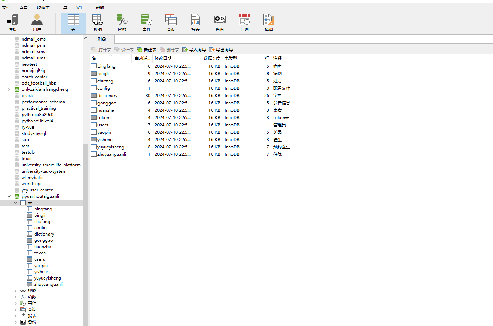

登录

基础数据管理

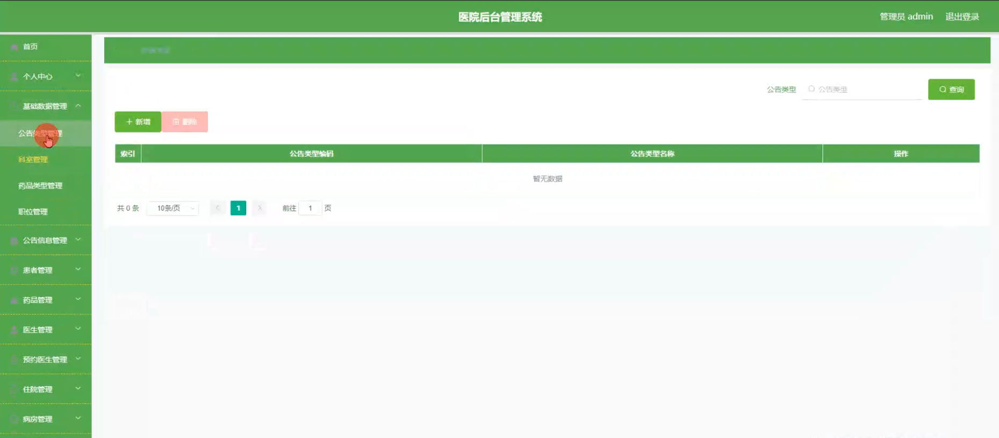

患者管理

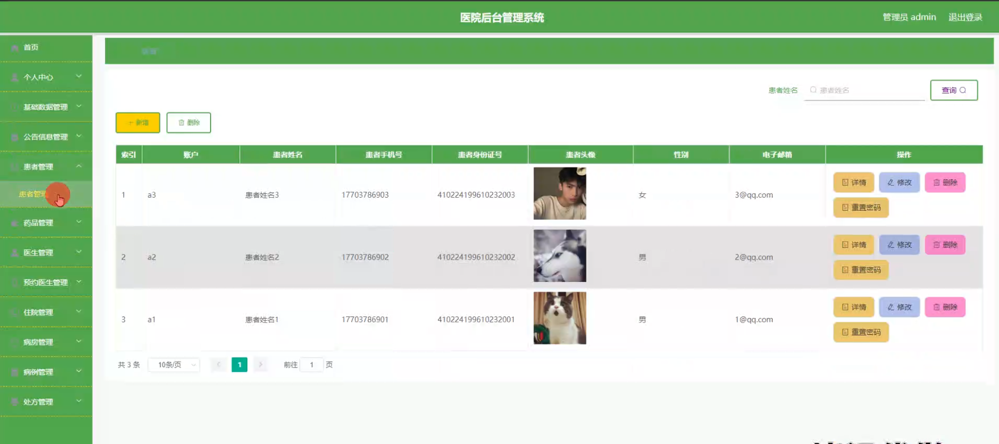

药品管理

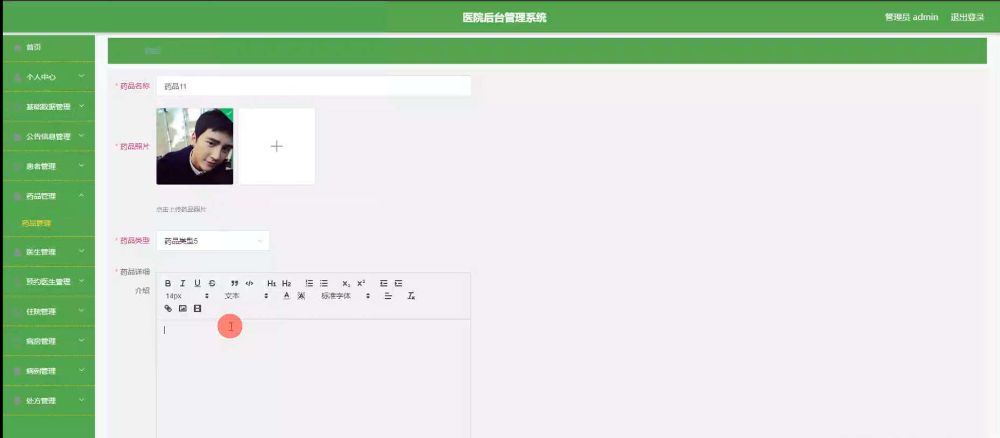

医生管理

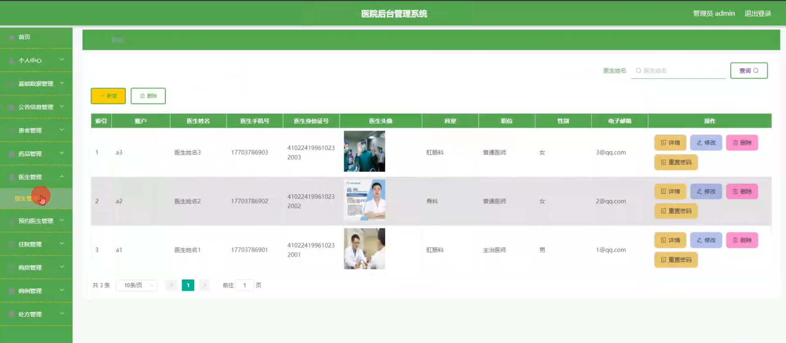

预约医生管理

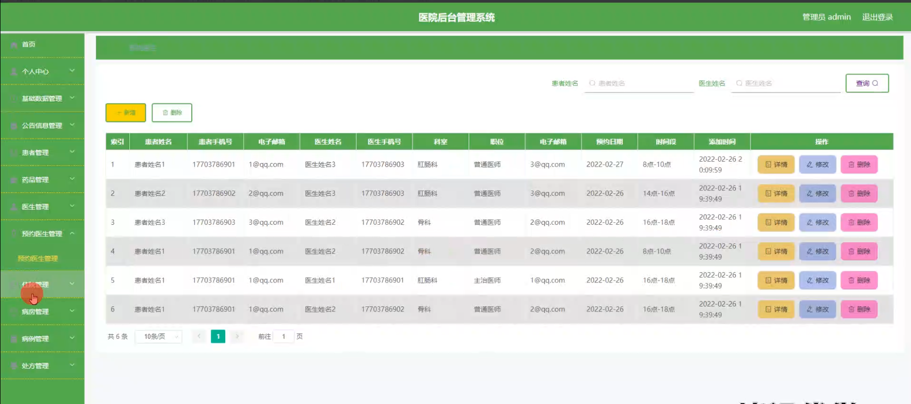

住院管理

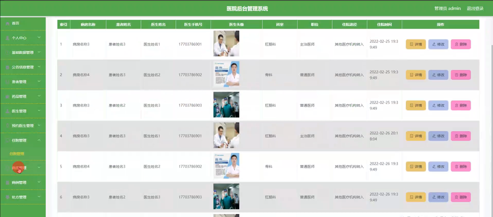

病例管理

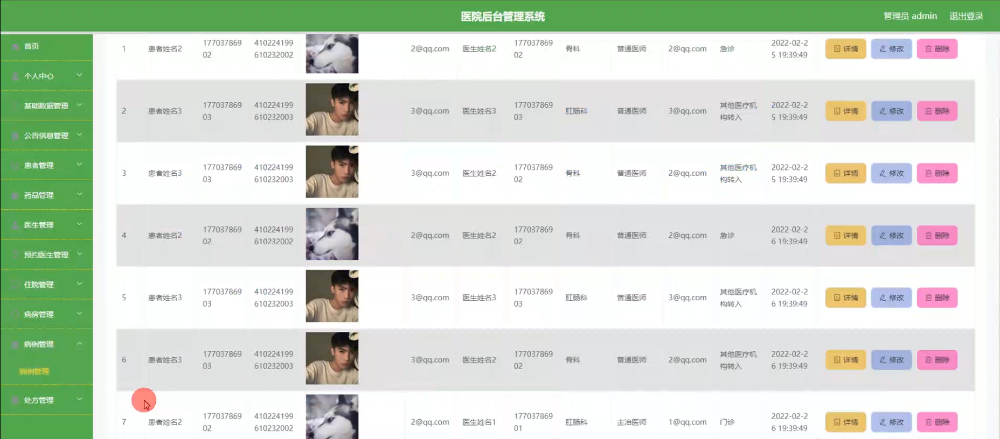

预约医生管理

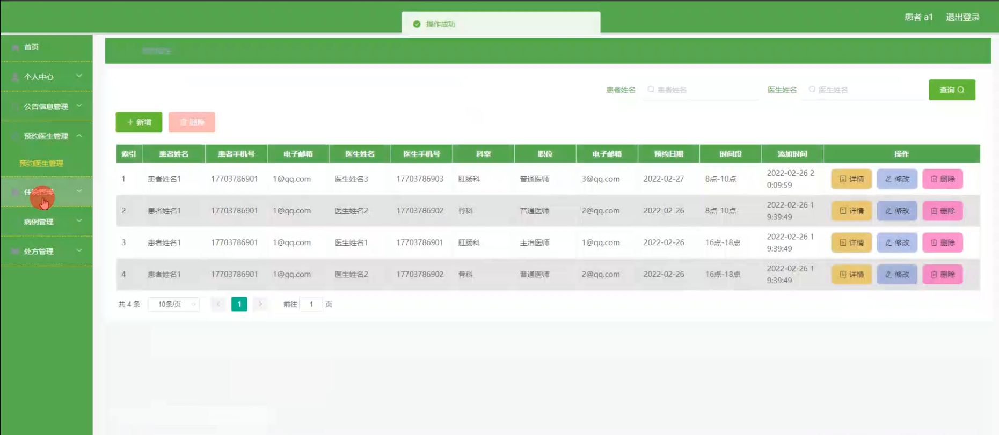

患者端个人信息

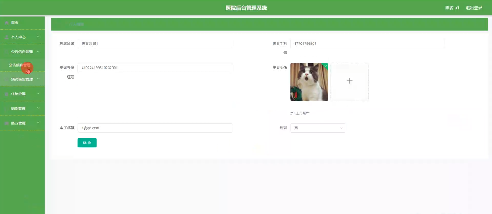

处方管理

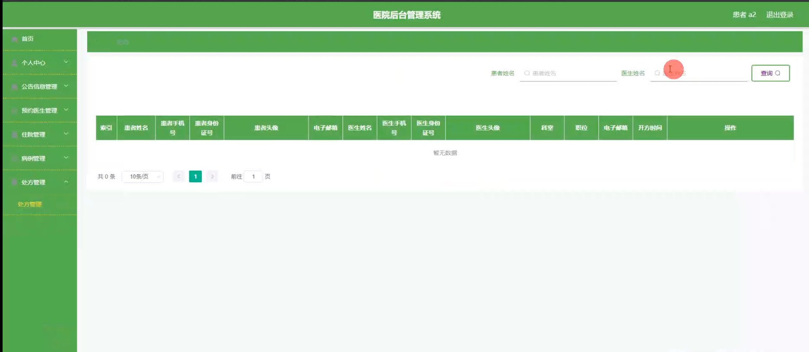

医生端病房管理

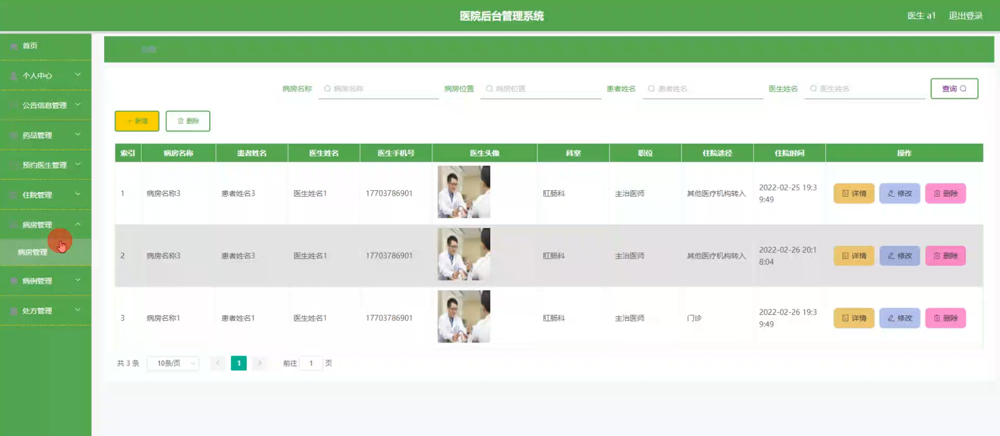

#### 总结

基于 Spring Boot 的医院后台管理系统，通过明确管理端、患者端和医生端的功能职责，实现了医院管理的信息化、规范化和智能化。该系统有助于提升医院的综合竞争力，为广大患者提供更优质的医疗服务。

#### 使用说明

创建数据库，执行数据库脚本 修改jdbc数据库连接参数 下载安装maven依赖jar 启动idea中的springboot项目

后台登录页面
http://localhost:8080/yiyuanhoutaiguanli/admin/dist/index.html

管理员				账户:admin 		密码：admin

患者				账户:a1 		密码：123456

医生				账户:a1 		密码：123456